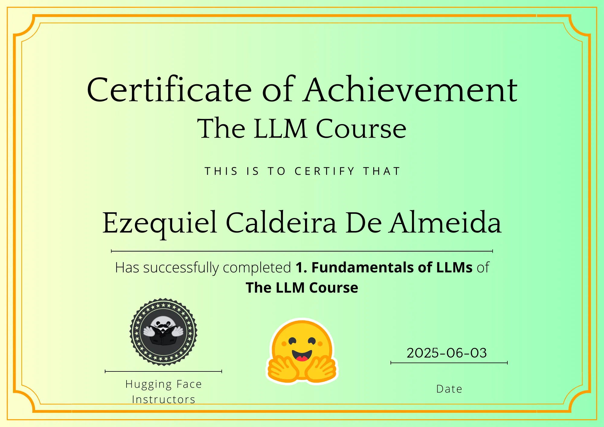

# Hugging Face LLM Course Notes

This repository contains my lecture notes, code, and additional resources related to the **Hugging Face LLM Course**. The course offers a comprehensive introduction to the world of Large Language Models (LLMs), from theoretical fundamentals to practical applications.

---

## Repository Structure

* **`01-transformers-models/`**:

---

## Original Course Link

You can access the original Hugging Face course via this link:
[https://huggingface.co/learn/llm-course](https://huggingface.co/learn/llm-course)

---

## Contributions

This repository is primarily for my personal notes. However, if you find any errors or have suggestions for improving the notes, feel free to reach me.

## Certificate

